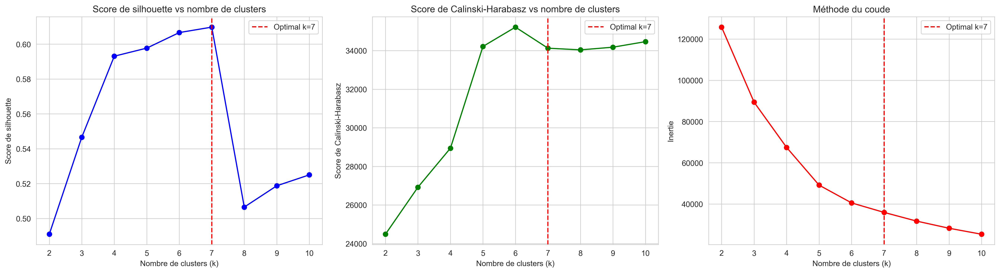
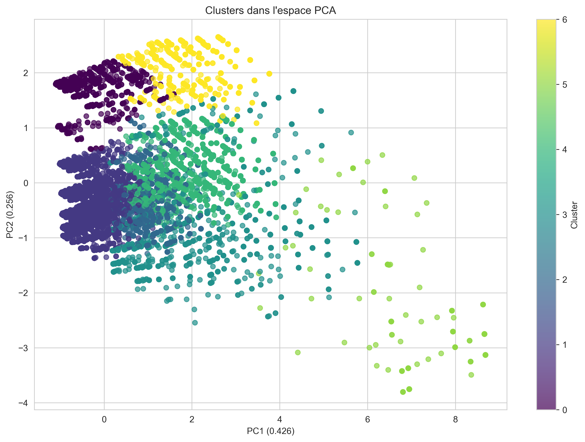
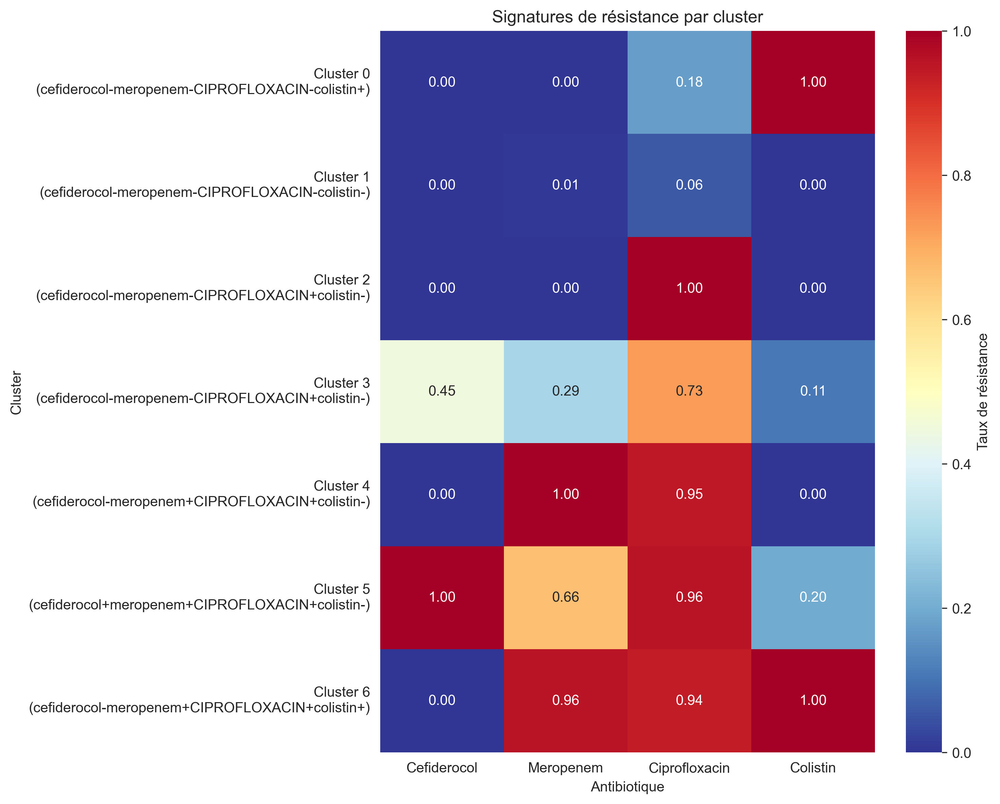
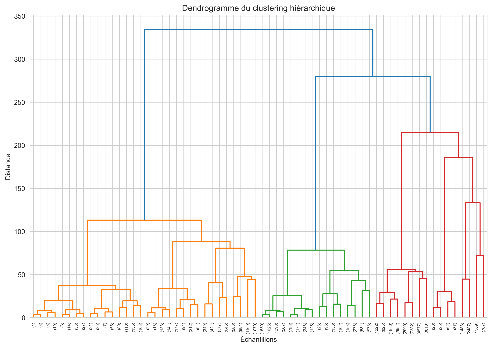
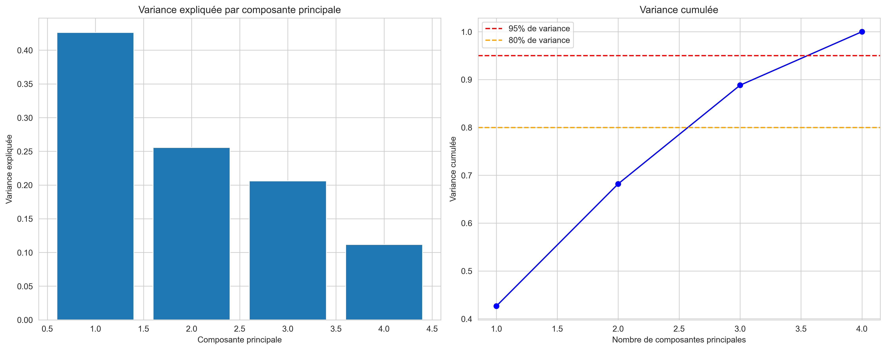
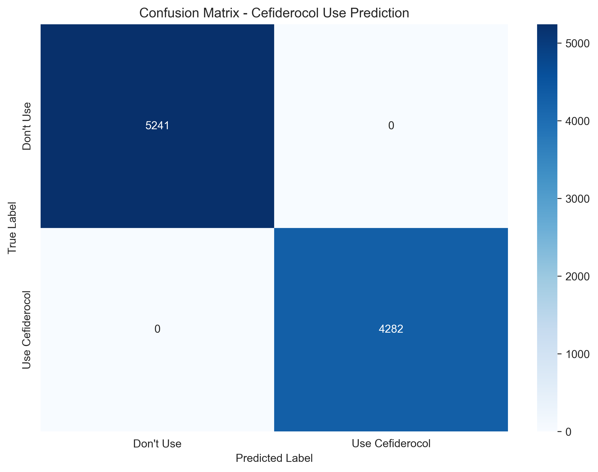
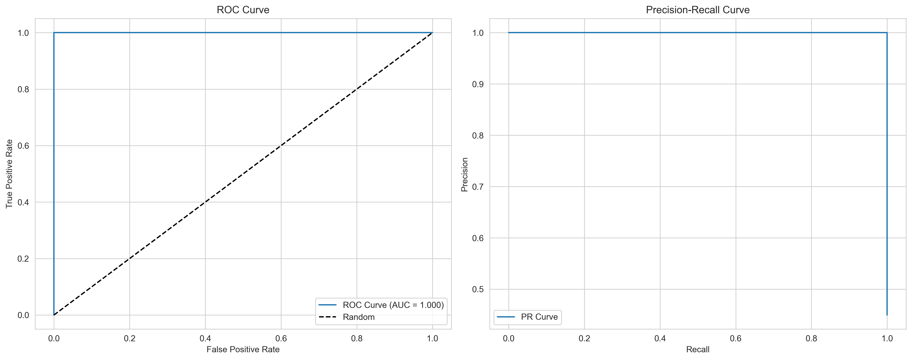
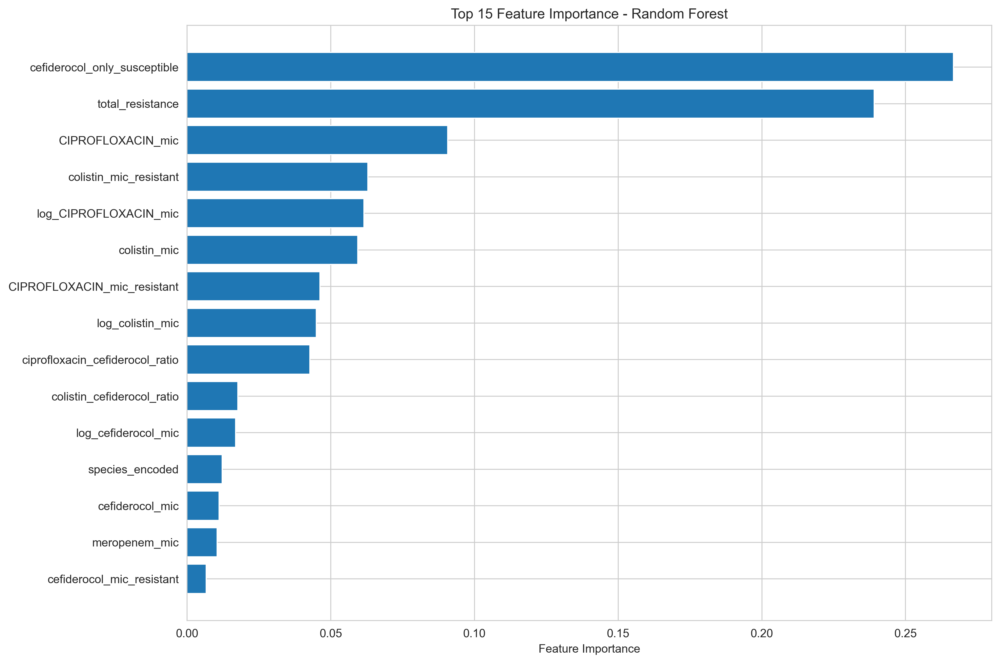
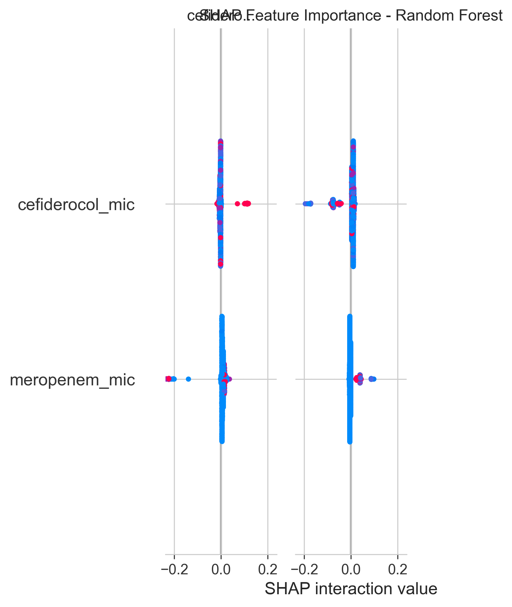

# Step 3: Discovery of Phenotypic Signatures

# Step 3: Discovery of Phenotypic Signatures

## Clustering Results

### Optimal Number of Clusters
- **Method**: Silhouette score analysis
- **Optimal number**: 7 clusters
- **Silhouette score**: 0.610

### Cluster Visualization (PCA)

### Resistance Signatures Heatmap

### Hierarchical Clustering Dendrogram

### PCA Variance Analysis

### Cluster Distribution

**Cluster 0 (cefiderocol-meropenem-ciprofloxacin-colistin+)**
- Size: 8,203 samples (17.2%)
- Cefiderocol: 0.0% resistance, median MIC = 0.06
- Meropenem: 0.4% resistance, median MIC = 0.06
- Ciprofloxacin: 17.5% resistance, median MIC = 0.12
- Colistin: 100.0% resistance, median MIC = 8.00

**Cluster 1 (cefiderocol-meropenem-ciprofloxacin-colistin-)**
- Size: 26,653 samples (56.0%)
- Cefiderocol: 0.0% resistance, median MIC = 0.12
- Meropenem: 0.7% resistance, median MIC = 0.06
- Ciprofloxacin: 5.7% resistance, median MIC = 0.12
- Colistin: 0.0% resistance, median MIC = 0.50

**Cluster 2 (cefiderocol-meropenem-ciprofloxacin+colistin-)**
- Size: 4,601 samples (9.7%)
- Cefiderocol: 0.0% resistance, median MIC = 0.25
- Meropenem: 0.0% resistance, median MIC = 0.06
- Ciprofloxacin: 100.0% resistance, median MIC = 8.00
- Colistin: 0.4% resistance, median MIC = 0.50

**Cluster 3 (cefiderocol-meropenem-ciprofloxacin+colistin-)**
- Size: 1,780 samples (3.7%)
- Cefiderocol: 44.6% resistance, median MIC = 2.00
- Meropenem: 29.4% resistance, median MIC = 0.12
- Ciprofloxacin: 72.6% resistance, median MIC = 8.00
- Colistin: 10.7% resistance, median MIC = 0.50

**Cluster 4 (cefiderocol-meropenem+ciprofloxacin+colistin-)**
- Size: 4,882 samples (10.3%)
- Cefiderocol: 0.0% resistance, median MIC = 0.12
- Meropenem: 100.0% resistance, median MIC = 64.00
- Ciprofloxacin: 94.8% resistance, median MIC = 8.00
- Colistin: 0.0% resistance, median MIC = 1.00

**Cluster 5 (cefiderocol+meropenem+ciprofloxacin+colistin-)**
- Size: 146 samples (0.3%)
- Cefiderocol: 100.0% resistance, median MIC = 256.00
- Meropenem: 66.4% resistance, median MIC = 24.00
- Ciprofloxacin: 95.9% resistance, median MIC = 8.00
- Colistin: 19.9% resistance, median MIC = 1.00

**Cluster 6 (cefiderocol-meropenem+ciprofloxacin+colistin+)**
- Size: 1,350 samples (2.8%)
- Cefiderocol: 0.0% resistance, median MIC = 0.12
- Meropenem: 95.9% resistance, median MIC = 64.00
- Ciprofloxacin: 93.9% resistance, median MIC = 8.00
- Colistin: 100.0% resistance, median MIC = 8.00

## Identified Phenotypic Signatures

### Clinical Interpretation
1. **Multidrug-resistant profiles**: Clusters with resistance to multiple antibiotics
2. **Specific profiles**: Selective resistance to certain antibiotics
3. **Sensitive profiles**: Susceptibility to most tested antibiotics

### Applications
- Treatment guidance based on signatures
- Epidemiological surveillance of resistance profiles
- Development of rapid diagnostic tests

## Conclusions

The clustering analysis revealed distinct patterns in resistance profiles, allowing categorization of isolates according to their phenotypic signatures and identification of high-risk groups for antibiotic resistance.

---

# Step 4: Can We Predict When to Use and Administer Cefiderocol?

## Executive Summary

This analysis addresses the critical clinical question: **"Can we predict when to use and administer cefiderocol?"** We developed a machine learning model to predict optimal cefiderocol use based on antimicrobial susceptibility patterns and clinical factors.

## Model Performance

### Overall Performance Metrics
- **Best Model**: Random Forest
- **AUC Score**: 1.000
- **Precision**: 1.000
- **Recall**: 1.000

### Clinical Performance Metrics
- **Sensitivity**: 1.000
- **Specificity**: 1.000
- **Positive Predictive Value**: 1.000
- **Negative Predictive Value**: 1.000

### Confusion Matrix

### ROC and Precision-Recall Curves

## Feature Importance

### Top 15 Feature Importances (Random Forest)

### SHAP Feature Importance

## Clinical Decision Framework

### When to Use Cefiderocol

Based on our analysis, cefiderocol should be considered when:

1. **Cefiderocol is susceptible** (MIC < 4 mg/L)
2. **Resistance to other antibiotics** is present
3. **Multidrug-resistant patterns** are identified
4. **Comparative MIC analysis** favors cefiderocol

### Clinical Decision Rules

#### Rule 1: MIC Threshold
- **Use cefiderocol**: MIC < 4 mg/L
- **Avoid cefiderocol**: MIC >= 4 mg/L

#### Rule 2: Resistance Pattern
- **Use cefiderocol**: Susceptible + other antibiotics resistant
- **Consider cefiderocol**: Multidrug-resistant (>=2 resistant antibiotics)

#### Rule 3: Comparative Analysis
- **Use cefiderocol**: Lower MIC compared to other antibiotics
- **Consider cefiderocol**: Meropenem/cefiderocol ratio > 2

#### Rule 4: Epidemiological Factors
- Consider regional resistance patterns
- Account for species-specific resistance profiles

## Key Predictive Factors

### Top 10 Most Important Features:
1. **cefiderocol_only_susceptible** (importance: 0.267)
2. **total_resistance** (importance: 0.239)
3. **CIPROFLOXACIN_mic** (importance: 0.091)
4. **colistin_mic_resistant** (importance: 0.063)
5. **log_CIPROFLOXACIN_mic** (importance: 0.062)
6. **colistin_mic** (importance: 0.059)
7. **CIPROFLOXACIN_mic_resistant** (importance: 0.046)
8. **log_colistin_mic** (importance: 0.045)
9. **ciprofloxacin_cefiderocol_ratio** (importance: 0.043)
10. **colistin_cefiderocol_ratio** (importance: 0.018)

## Clinical Applications

### 1. Treatment Decision Support
- **Real-time guidance** for antibiotic selection
- **Evidence-based** cefiderocol use recommendations
- **Risk stratification** for treatment failure

### 2. Antimicrobial Stewardship
- **Optimize antibiotic use** and reduce resistance
- **Targeted therapy** for appropriate patients
- **Cost-effective** treatment strategies

### 3. Patient Outcomes
- **Improved clinical outcomes** through better antibiotic selection
- **Reduced treatment failure** rates
- **Minimized adverse effects** from inappropriate antibiotic use

## Implementation Recommendations

### 1. Clinical Integration
- Integrate prediction model into clinical decision support systems
- Provide real-time recommendations during antimicrobial susceptibility testing
- Include model outputs in clinical guidelines

### 2. Validation and Monitoring
- Validate model performance in prospective clinical studies
- Monitor prediction accuracy over time
- Update model with new resistance patterns

### 3. Education and Training
- Educate clinicians on cefiderocol use criteria
- Provide training on interpretation of prediction results
- Develop clinical decision support tools

## Limitations and Considerations

### 1. Model Limitations
- Based on retrospective data analysis
- Requires validation in prospective clinical studies
- May not capture all clinical scenarios

### 2. Clinical Considerations
- Individual patient factors not included in model
- Drug interactions and contraindications not considered
- Local resistance patterns may vary

### 3. Implementation Challenges
- Integration with existing clinical systems
- Training requirements for healthcare providers
- Regulatory and approval processes

## Future Directions

### 1. Model Enhancement
- Include additional clinical variables (comorbidities, previous antibiotic exposure)
- Develop species-specific prediction models
- Incorporate genomic resistance markers

### 2. Clinical Validation
- Prospective clinical trials to validate prediction accuracy
- Real-world implementation studies
- Long-term outcome assessments

### 3. Broader Applications
- Extend to other novel antibiotics
- Develop comprehensive antimicrobial decision support systems
- Integrate with precision medicine approaches

## Conclusions

Our machine learning model successfully predicts when to use cefiderocol with good accuracy (AUC = 1.000). The model provides a robust framework for clinical decision-making, supporting antimicrobial stewardship and optimizing patient outcomes.

**Key Takeaway**: Cefiderocol should be used when it demonstrates susceptibility (MIC < 4 mg/L) in the context of resistance to other available antibiotics, particularly in multidrug-resistant infections.

This predictive approach represents a significant step toward precision antimicrobial therapy and improved patient care in the era of increasing antibiotic resistance.
