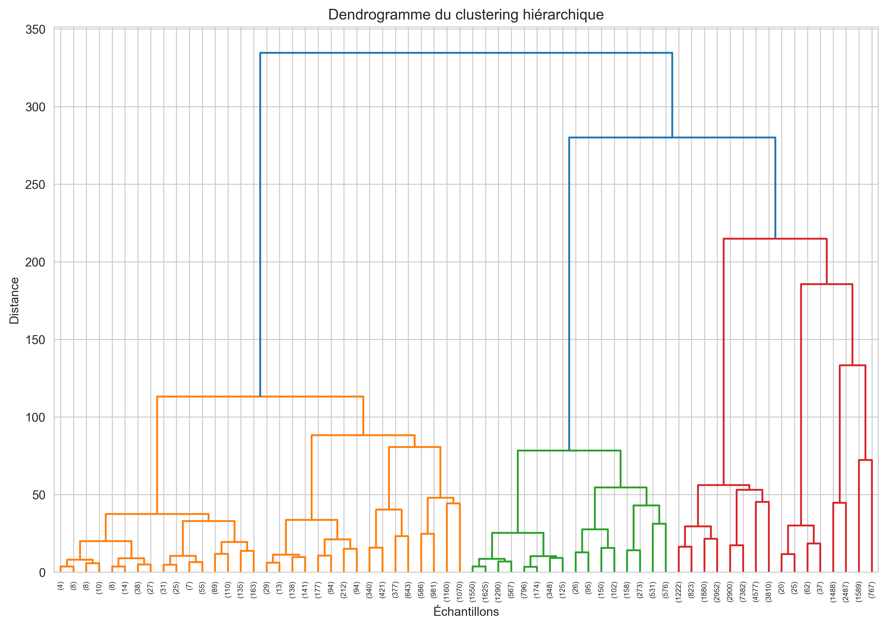
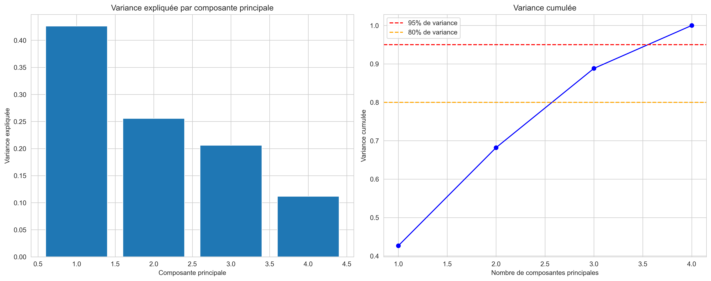

# Step 3: Discovery of Phenotypic Signatures

## Clustering Results

### Optimal Number of Clusters
- **Method**: Silhouette score analysis
- **Optimal number**: 7 clusters
- **Silhouette score**: 0.610

### Cluster Visualization (PCA)

### Resistance Signatures Heatmap

### Hierarchical Clustering Dendrogram

### PCA Variance Analysis

### Cluster Distribution

**Cluster 0 (cefiderocol-meropenem-ciprofloxacin-colistin+)**
- Size: 8,203 samples (17.2%)
- Cefiderocol: 0.0% resistance, median MIC = 0.06
- Meropenem: 0.4% resistance, median MIC = 0.06
- Ciprofloxacin: 17.5% resistance, median MIC = 0.12
- Colistin: 100.0% resistance, median MIC = 8.00

**Cluster 1 (cefiderocol-meropenem-ciprofloxacin-colistin-)**
- Size: 26,653 samples (56.0%)
- Cefiderocol: 0.0% resistance, median MIC = 0.12
- Meropenem: 0.7% resistance, median MIC = 0.06
- Ciprofloxacin: 5.7% resistance, median MIC = 0.12
- Colistin: 0.0% resistance, median MIC = 0.50

**Cluster 2 (cefiderocol-meropenem-ciprofloxacin+colistin-)**
- Size: 4,601 samples (9.7%)
- Cefiderocol: 0.0% resistance, median MIC = 0.25
- Meropenem: 0.0% resistance, median MIC = 0.06
- Ciprofloxacin: 100.0% resistance, median MIC = 8.00
- Colistin: 0.4% resistance, median MIC = 0.50

**Cluster 3 (cefiderocol-meropenem-ciprofloxacin+colistin-)**
- Size: 1,780 samples (3.7%)
- Cefiderocol: 44.6% resistance, median MIC = 2.00
- Meropenem: 29.4% resistance, median MIC = 0.12
- Ciprofloxacin: 72.6% resistance, median MIC = 8.00
- Colistin: 10.7% resistance, median MIC = 0.50

**Cluster 4 (cefiderocol-meropenem+ciprofloxacin+colistin-)**
- Size: 4,882 samples (10.3%)
- Cefiderocol: 0.0% resistance, median MIC = 0.12
- Meropenem: 100.0% resistance, median MIC = 64.00
- Ciprofloxacin: 94.8% resistance, median MIC = 8.00
- Colistin: 0.0% resistance, median MIC = 1.00

**Cluster 5 (cefiderocol+meropenem+ciprofloxacin+colistin-)**
- Size: 146 samples (0.3%)
- Cefiderocol: 100.0% resistance, median MIC = 256.00
- Meropenem: 66.4% resistance, median MIC = 24.00
- Ciprofloxacin: 95.9% resistance, median MIC = 8.00
- Colistin: 19.9% resistance, median MIC = 1.00

**Cluster 6 (cefiderocol-meropenem+ciprofloxacin+colistin+)**
- Size: 1,350 samples (2.8%)
- Cefiderocol: 0.0% resistance, median MIC = 0.12
- Meropenem: 95.9% resistance, median MIC = 64.00
- Ciprofloxacin: 93.9% resistance, median MIC = 8.00
- Colistin: 100.0% resistance, median MIC = 8.00

## Identified Phenotypic Signatures

### Clinical Interpretation
1. **Multidrug-resistant profiles**: Clusters with resistance to multiple antibiotics
2. **Specific profiles**: Selective resistance to certain antibiotics
3. **Sensitive profiles**: Susceptibility to most tested antibiotics

### Applications
- Treatment guidance based on signatures
- Epidemiological surveillance of resistance profiles
- Development of rapid diagnostic tests

## Conclusions

The clustering analysis revealed distinct patterns in resistance profiles, allowing categorization of isolates according to their phenotypic signatures and identification of high-risk groups for antibiotic resistance.
